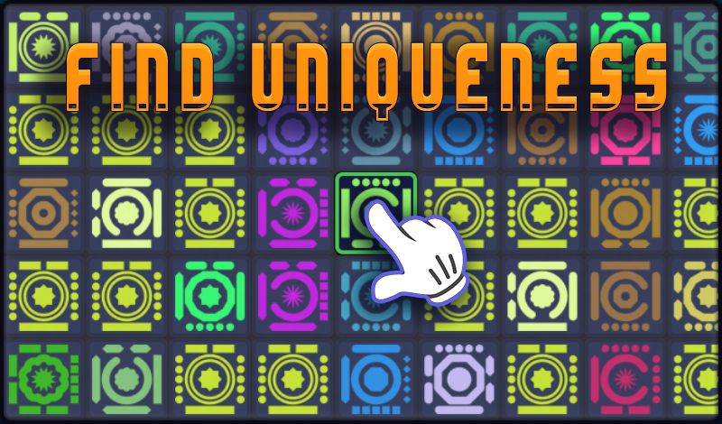
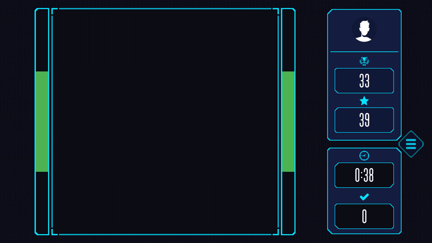

 

> "Find uniqueness" is a game of attention and memory in which you can not only practice these useful skills, but also have an interesting time.
>> The game offers you to find a unique pattern among the presented options in the allotted time. The more patterns you manage to find, the more points you will earn. With each level, the task becomes more difficult, challenging your powers of observation.
Be careful though, if you make a mistake or do not have time to choose a pattern, the game will end. But don't worry, after completing each level, you'll have the opportunity to win extra time in bonus levels. 
Immerse yourself in the world of uniqueness seekers and enjoy the game!

 

 

 

